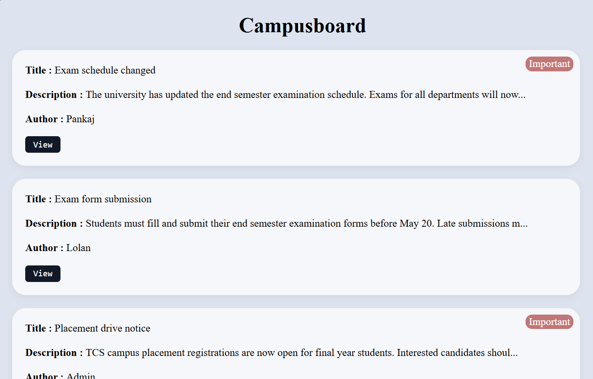
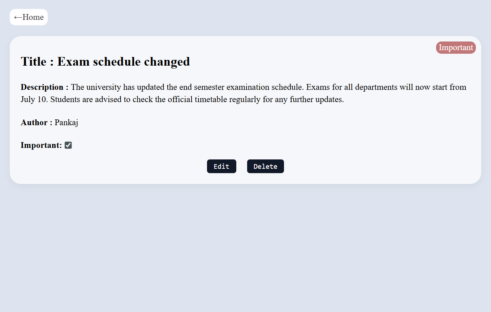
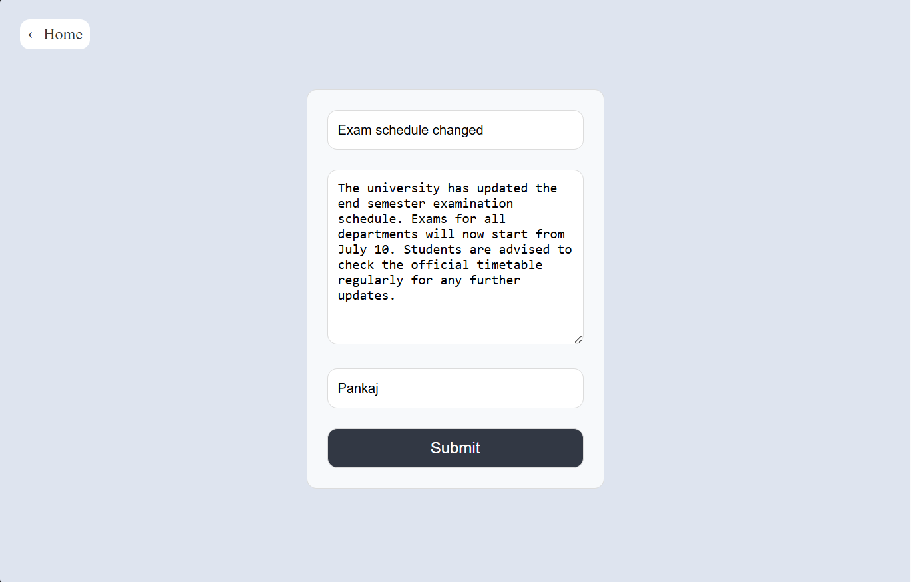
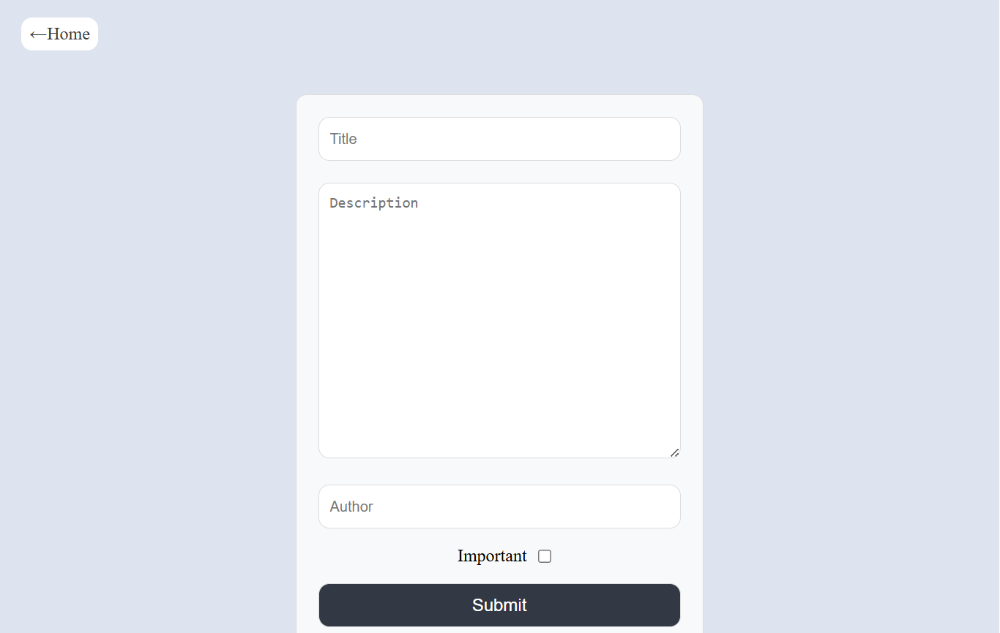

# Campusboard

A digital notice board web application for college students 
built with Node.js, Express.js, and EJS.

## Features
- View all campus notices
- Add new notice with title, description and author
- Edit existing notices
- Delete notices
- Mark notice as Important
- Data persists during server session

## Tech Stack
- Node.js
- Express.js
- EJS (Embedded JavaScript Templates)
- method-override
- CSS (written from scratch)

## Getting Started

### Prerequisites
- Node.js installed

### Installation
```bash
git clone https://github.com/Pankaj-240/Campusboard.git
cd Campusboard
npm install
node index.js
```

Server runs at `http://localhost:8000`

## Routes

| Method | Route | Description |
|--------|-------|-------------|
| GET | `/notices` | View all notices |
| GET | `/notices/new` | Add notice form |
| POST | `/notices` | Create new notice |
| GET | `/notices/:id` | View single notice |
| GET | `/notices/:id/edit` | Edit notice form |
| PUT | `/notices/:id` | Update notice |
| PATCH | `/notices/:id/important` | Toggle important |
| DELETE | `/notices/:id` | Delete notice |

## Note
Data is stored in memory and resets on server restart.
MongoDB integration planned as next step.

## Screenshots




